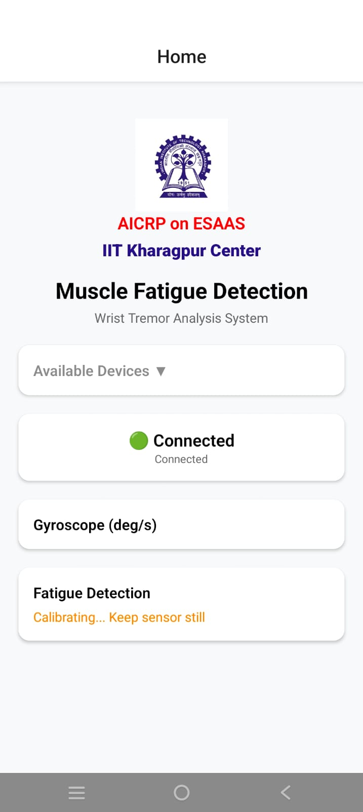
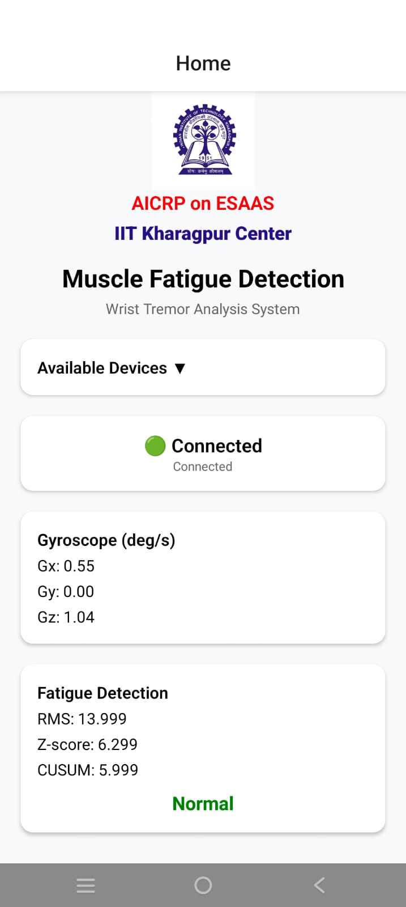
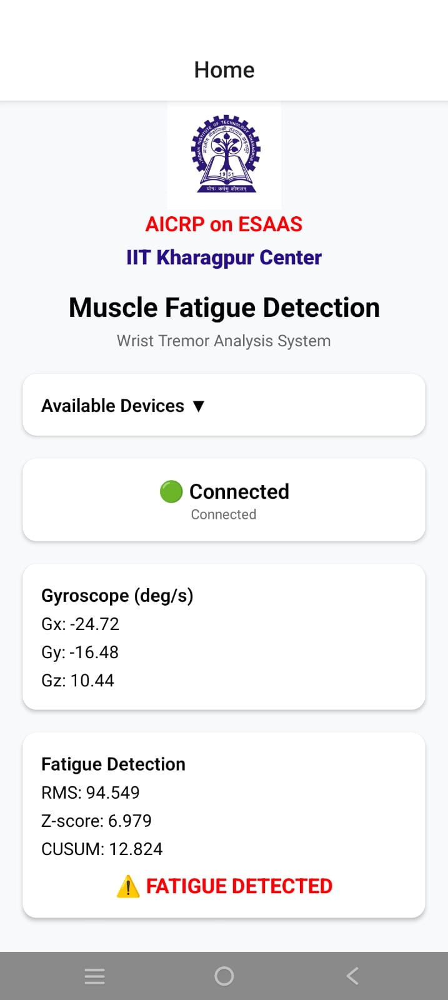

# Muscle Fatigue Monitor

A React Native mobile application for real-time muscle fatigue detection using wrist tremor analysis. Developed under **AICRP on ESAAS** at **IIT Kharagpur Center**.

## Overview

This application connects to Bluetooth Low Energy (BLE) enabled wearable sensors to monitor gyroscope data and detect muscle fatigue in real-time. It employs advanced signal processing techniques and statistical analysis to identify fatigue patterns through wrist tremor measurements.

## Features

- **BLE Device Scanning & Connection**: Automatically discovers and connects to nearby BLE-enabled wearable sensors
- **Real-time Gyroscope Monitoring**: Displays live 3-axis gyroscope data (Gx, Gy, Gz) in degrees per second
- **Automatic Calibration**: Self-calibrating system that accounts for sensor bias
- **Fatigue Detection Algorithm**: Uses advanced signal processing techniques including:
  - FIR Bandpass filtering for tremor isolation
  - RMS (Root Mean Square) calculation for signal magnitude
  - Z-score normalization for statistical analysis
  - CUSUM (Cumulative Sum) algorithm for change detection
- **Real-time Feedback**: Visual indicators showing fatigue percentage and detection status
- **Clean, Intuitive UI**: Modern interface with status indicators and data visualization

## Screenshots

<div align="center">

### Calibration Phase


Device connected and calibrating sensor baseline

---

### Normal Operation


Real-time monitoring with normal fatigue levels

---

### Fatigue Detected


Alert displayed when fatigue threshold is exceeded

</div>

## Technology Stack

- **Framework**: React Native with Expo
- **Language**: TypeScript
- **BLE Communication**: react-native-ble-plx
- **Navigation**: Expo Router
- **Platform Support**: iOS and Android

## How It Works

### Signal Processing Pipeline

1. **Data Acquisition**: Raw gyroscope data (Gx, Gy, Gz) is received from the BLE sensor at approximately 100 Hz

2. **Calibration**: The system collects 600 samples (~6 seconds) to establish sensor bias:
   - Calculates mean offset for each axis
   - Applies deadband filter (±0.5°/s) to remove noise

3. **Tremor Extraction**:
   - Computes magnitude of gyroscope vector
   - Applies FIR bandpass filter with dual exponential smoothing:
     - Fast alpha: 0.2 (high-pass component)
     - Slow alpha: 0.02 (low-pass component)

4. **Feature Extraction**:
   - Sliding window of 200 samples (2 seconds)
   - Computes RMS of filtered tremor signal

5. **Statistical Analysis**:
   - Adaptive baseline estimation using exponential moving average
   - Variance estimation for normalization
   - Z-score calculation for standardized deviation

6. **Fatigue Detection**:
   - CUSUM algorithm tracks cumulative deviation
   - Reference value (k): 0.3
   - Threshold factor: 7
   - Fatigue percentage: (CUSUM / threshold) × 100%
   - Alert triggered when CUSUM exceeds threshold

### BLE Configuration

- **Service UUID**: `0000ffe5-0000-1000-8000-00805f9a34fb`
- **Read Characteristic UUID**: `0000ffe4-0000-1000-8000-00805f9a34fb`
- **Write Characteristic UUID**: `0000ffe9-0000-1000-8000-00805f9a34fb`
- **Data Frame**: 20 bytes per packet
- **Gyroscope Data Format**: 16-bit signed integers, ±2000°/s range

## Installation

### Prerequisites

- Node.js (v18 or higher)
- npm or yarn
- Expo CLI
- iOS Simulator (for iOS development) or Android Studio (for Android development)

### Setup

1. Clone the repository:
```bash
git clone <repository-url>
cd client
```

2. Install dependencies:
```bash
npm install
```

3. Start the development server:
```bash
npm start
```

4. Run on your preferred platform:
```bash
# iOS
npm run ios

# Android
npm run android

# Web
npm run web
```

## Usage

1. **Launch the App**: Open the application on your mobile device

2. **Enable Bluetooth**: Ensure Bluetooth is enabled on your device and permissions are granted

3. **Scan for Devices**: The app automatically scans for nearby BLE devices. Tap "Available Devices" to view the list

4. **Connect to Sensor**: Select your wearable sensor from the list to establish connection

5. **Calibration**: Keep the sensor still for approximately 6 seconds during calibration
   - Orange text "Calibrating... Keep sensor still" will be displayed

6. **Monitor Fatigue**: Once calibrated, the app will display:
   - Real-time gyroscope readings (Gx, Gy, Gz)
   - RMS value (tremor magnitude)
   - Z-score (statistical deviation)
   - CUSUM value (cumulative deviation)
   - Fatigue percentage (0-100%)
   - Status: "Normal" (green) or "FATIGUE DETECTED" (red)

## Project Structure

```
client/
├── app/
│   └── index.tsx          # Main application component with BLE logic
├── assets/
│   └── images/
│       └── logo.png       # IIT Kharagpur logo
├── screenshots/           # Application screenshots
│   ├── 1.jpeg
│   ├── 2.jpeg
│   └── 3.jpeg
├── package.json          # Project dependencies
└── README.md            # This file
```

## Key Components

### FIRBandpass Class
Implements a dual exponential moving average filter for tremor isolation:
- Separates fast movements (tremor) from slow movements (voluntary motion)
- Real-time processing with minimal latency

### WristFatigueDetector Class
Core fatigue detection engine featuring:
- Automatic calibration system
- Adaptive statistical modeling
- CUSUM-based change detection
- Configurable thresholds and parameters

## Requirements

### Hardware
- BLE-enabled wearable sensor with gyroscope
- Compatible with standard BLE 4.0+ protocols
- Mobile device with BLE support (iOS 10+ or Android 5.0+)

### Permissions
- **Android**:
  - BLUETOOTH_SCAN
  - BLUETOOTH_CONNECT
  - ACCESS_FINE_LOCATION
- **iOS**: Bluetooth permission (automatically handled)

## Development

### Available Scripts

- `npm start` - Start Expo development server
- `npm run android` - Run on Android device/emulator
- `npm run ios` - Run on iOS simulator/device
- `npm run web` - Run in web browser
- `npm run lint` - Run ESLint for code quality

## Algorithm Parameters

The following parameters can be adjusted in the `WristFatigueDetector` class:

- `win`: Window size for RMS calculation (default: 200 samples)
- `alpha`: Adaptation rate for mean estimation (default: 0.02)
- `beta`: Adaptation rate for variance estimation (default: 0.02)
- `k`: CUSUM reference value (default: 0.3)
- `thresholdFactor`: CUSUM threshold for detection (default: 7)
- `deadband`: Noise rejection threshold (default: 0.5°/s)

## Acknowledgments

This project is developed under the **All India Coordinated Research Project (AICRP) on Ergonomics and Safety in Agriculture and Allied Sectors (ESAAS)** at **IIT Kharagpur Center**.

## License

This project is part of academic research at IIT Kharagpur.

---

**Developed at IIT Kharagpur Center**
*AICRP on ESAAS*
